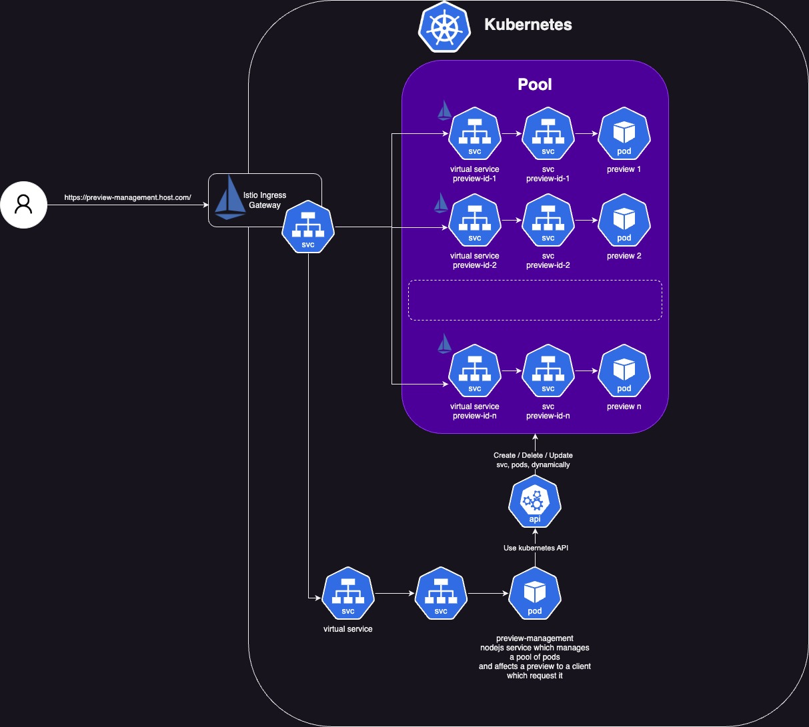

# Preview Project README

## Introduction

The Preview Project is a system designed to dynamically create and manage a pool of pods in a Kubernetes cluster and to allocate a dedicated container to a client responsible to build and render the preview of an application. The Preview Management Service, our core module, is responsible for creating, maintaining this pool of pods dynamically and allocating a pod to a client session, ensuring high availability and fault tolerance.

## Features

- **Dynamic Pod Creation:** The Preview Management Service can automatically create new pods as needed, ensuring that new client can get a preview of their application a few seconds after requesting one.

- **Pod Pool Management:** The system maintains a pool of pods, ready to be deployed as soon as they're needed. This ensures rapid response times and minimizes server downtime.

- **Hosted in Kubernetes:** By hosting the Expo server in a Kubernetes cluster, the Preview Project can leverage the cluster's inherent scalability, resilience, and self-healing capabilities.

High level design



## Prerequisites

- Knowledge of Kubernetes (Pods, Deployments, Services, Istio, Virtual Services, etc.)
- Kubernetes cluster (locally with minikube, docker desktop or online service like GCP, AWS, Azure)
- Docker
- Helm
- Expo server setup knowledge

## Setup and Installation

**Prepare Your Kubernetes Cluster**

Make sure your Kubernetes cluster is set up and configured correctly. If you're using an online service like Google Cloud, AWS, or Azure, follow their respective guides. If you're using minikube, follow the installation guide.

You can use also Docker Destop Kubernetes cluster. It's a quick and easy way to run a local Kubernetes and you won't need to publish docker images to a registry. The Kubernetes cluster will use your local docker images directly.

This project uses Istio, so you'll need to install that on your Kubernetes cluster as well. Look at the following documentation which explains how to proceed: [Istio Getting Started](https://istio.io/latest/docs/setup/getting-started/#download)

you will also need to deploy the gateway configuration file. The goal of this configuration is to set up an ingress gateway, which acts as the entry point for external traffic coming into your Istio service mesh.

```bash
> kubectl apply -f ./deployment/gateway.yaml
```

The expo application is located inside ./packages/react-native-preview. Before starting the Preview Management Service, you'll need to build a docker image of the expo application:

```bash
> cd ./packages/react-native-preview
> yarn build:docker
```


## Running the Application

Once everything is set up and configured correctly, execute the following command:

```bash
> nx serve preview-management
```

The Preview Management Service will start maintaining a pool of pods in your Kubernetes cluster. You can monitor this pool using the Kubernetes Dashboard or command line tools.

## Maintainers

Please feel free to reach out to the project maintainers if you have any questions or concerns.

## Contribute

To contribute to this project, please fork the repository, make your updates and send us a pull request. Your contributions are more than welcome!

## License

This project is licensed under the [MIT license](https://opensource.org/licenses/MIT).

## Feedback

We welcome your feedback and suggestions on how to make this project better. Please feel free to open an issue if you have any problems or suggestions.

---

**Disclaimer:** Please make sure to thoroughly test this system in a non-production environment before deploying it in a production setting.
````
